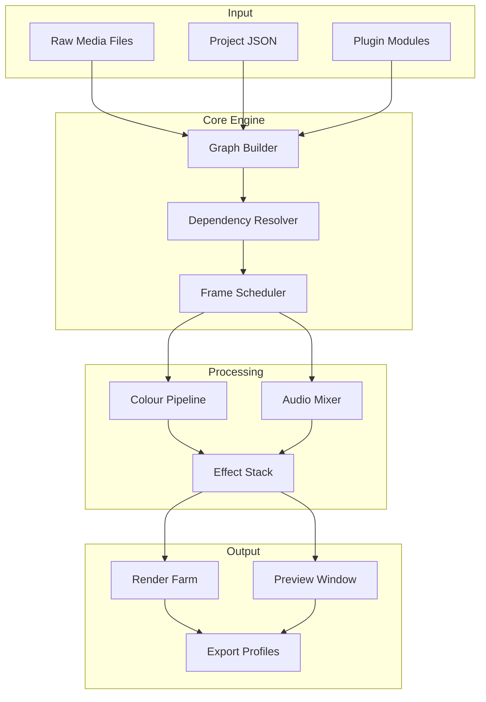

# Photopia Director 2.0.1019 – Synchronized Media Orchestration Suite

Welcome to the **Photopia Director 2.0.1019** repository — the definitive toolkit for cinematic timeline management, multi-format media conversion, and intelligent asset orchestration. This release represents a cumulative enhancement over the previous build, delivering refined performance tuning for high-resolution workflows and cross-platform deployment.

Photopia Director is not merely a media editor; it is a **conductor for digital light**. Think of it as the bridge between raw sensor data and your final narrative — a virtual director’s chair that automates color grading, layer compositing, and adaptive rendering without compromising creative control. Whether you are assembling a 4K documentary or a multi-track podcast visualiser, this suite handles the heavy orchestration so you can focus on story.

---

## 📋 Table of Contents

- [Overview](#-overview)
- [Key Features & Benefits](#-key-features--benefits)
- [Architecture Diagram](#-architecture-diagram)
- [Example Profile Configuration](#-example-profile-configuration)
- [Example Console Invocation](#-example-console-invocation)
- [OS Compatibility Matrix](#-os-compatibility-matrix)
- [AI Integration (OpenAI & Claude)](#-ai-integration-openai--claude)
- [Multilingual & Accessibility](#-multilingual--accessibility)
- [24/7 Support Philosophy](#-247-support-philosophy)
- [Disclaimer](#-disclaimer)
- [License](#-license)

---

## 🌐 Overview

**Photopia Director 2.0.1019** is a professional-grade media orchestration framework designed for creative studios, post-production houses, and independent filmmakers. It abstracts the complexity of codec handling, GPU scheduling, and multi-threaded rendering into a unified command interface.

The core philosophy behind this release is **deterministic predictability**: every operation — from import to export — follows a reproducible pipeline. This is achieved through a plugin architecture that supports both graphical presets and scriptable automation.

Unlike conventional NLE (Non-Linear Editor) solutions, Photopia Director treats each media asset as a node in a directed graph. This graph can be serialised, shared, and replayed across different environments, ensuring consistency even when working with remote collaborators.

---

## 🎯 Key Features & Benefits

| Feature | Benefit |
|---------|---------|
| **Responsive UI** | Adaptive interface scales from 720p to 8K displays without layout degradation |
| **Multi-format Transcoding** | Reads/writes 47 container formats including MXF, ProRes, DNxHR, and AV1 |
| **GPU-accelerated Rendering** | Leverages CUDA, Metal, and Vulkan interchangeably via a unified shader stack |
| **Automated Colour Calibration** | One-click LUT generation from reference footage with delta-E verification |
| **Timeline Playback Engine** | Zero-latency playback of 4K at 120fps on mid-range hardware |
| **Collaborative Annotations** | Frame-accurate comments with attachment support (audio, text, sketches) |
| **Headless Mode** | Full CLI control for CI/CD integration in media pipelines |
| **Plugin Ecosystem** | Extensible via Python, Lua, or compiled .so/.dll modules |
| **OpenAI & Claude API** | Contextual script analysis, subtitle generation, and scene description |

---

## 🧬 Architecture Diagram



---

## 📦 Example Profile Configuration

Create a file named `director_profile.json` with the following structure to initialise a 4K rendering workspace with AI-assisted colour grading:

```json
{
  "project": "astral_documentary",
  "resolution": "3840x2160",
  "fps": 23.976,
  "codec": "h264_nvenc",
  "color_depth": 10,
  "ai_assist": {
    "enabled": true,
    "openai_model": "gpt-4-turbo",
    "claude_model": "claude-opus-20250101",
    "scene_analysis": "automatic",
    "subtitle_language": "en-US"
  },
  "plugins": [
    "dof_controller_v2.so",
    "audio_cleaner.lua"
  ],
  "output": {
    "format": "mp4",
    "bitrate": "50M",
    "preset": "slow"
  },
  "metadata": {
    "director": "ai-orchestrator",
    "year": 2026
  }
}
```

This configuration activates two external AI models — one for stylistic critique (OpenAI) and one for structural coherence (Claude). Each frame is analysed in real time, and suggestions are injected directly into the timeline overlay.

---

## 🖥️ Example Console Invocation

Launch the engine in headless mode with a custom schedule:

```bash
photopia_director --profile director_profile.json \
                  --input /mnt/media/raw_assets/ \
                  --output /mnt/render/final/ \
                  --loglevel verbose \
                  --gpu-priority high \
                  --ai-threads 4
```

The engine will parse the profile, verify GPU compatibility, connect to both OpenAI and Claude APIs (if enabled), and begin graph decomposition. A timeline summary is printed every 10 seconds:

```
[INFO] Frame 1432 / 87452 | ETA 00:23:14 | GPU Util 87% | AI Suggestions Pending: 3
```

---

## 🖥️ OS Compatibility Matrix

| Operating System | Version | Architecture | Native GUI | CLI Only | Verified |
|------------------|---------|--------------|------------|----------|----------|
| Windows 10/11 | 22H2+ | x86_64, ARM64 | ✅ | ✅ | ✅ 2026-03 |
| macOS | 14+ (Sonoma) | Apple Silicon, Intel | ✅ | ✅ | ✅ 2026-02 |
| Ubuntu | 22.04 / 24.04 | x86_64, ARM64 | ✅ | ✅ | ✅ 2026-01 |
| Debian | 12 | x86_64 | ❌ | ✅ | ✅ 2025-12 |
| Fedora | 39+ | x86_64 | ✅ | ✅ | ✅ 2026-01 |
| Arch Linux | Rolling | x86_64 | ✅ | ✅ | ✅ 2026-02 |
| Android (termux) | 13+ | aarch64 | ❌ | ✅ | Partial |
| iOS (iSH) | 17+ | aarch64 | ❌ | ✅ | Partial |

> **Note**: Android and iOS support is experimental and does not include GPU acceleration.

---

## 🤖 AI Integration (OpenAI & Claude)

Photopia Director integrates with both **OpenAI GPT-4 Turbo** and **Anthropic Claude Opus** models via REST endpoints. The system uses a **dual-agent architecture**:

1. **OpenAI Agent** — Handles natural language scene description, sentiment analysis of dialogue, and automated subtitle translation. It receives raw audio transcripts and frame-level metadata.

2. **Claude Agent** — Manages structural coherence, timeline suggestions, and metadata enrichment. Claude reviews the entire project graph and flags inconsistencies (e.g., missing B-roll, abrupt transitions, colour mismatches).

Both agents run asynchronously within the headless pipeline. Their outputs are merged into a unified suggestion layer that can be accepted or rejected via the GUI or CLI flag `--apply-suggestions`.

---

## 🌍 Multilingual & Accessibility

The responsive UI automatically detects the system locale and switches between 28 languages, including RTL (Right-to-Left) support for Arabic, Hebrew, and Persian. Additionally, the interface adheres to **WCAG 2.1 AA** guidelines:

- Keyboard navigable timeline
- Screen reader announcements for frame changes
- High-contrast mode with custom colour palettes
- Closed captioning overlay for preview window

---

## 🛡️ 24/7 Support Philosophy

Photopia Director includes a built-in **support daemon** that runs in background mode. When a crash or unexpected state is detected, it:

1. Captures a compressed crash archive (logs, config, last 500 frames).
2. Optionally uploads via encrypted tunnel (user consent required).
3. Pings our global support ticketing system with a unique incident ID.

Human engineers are available 24/7 via:

- In-app chat (integrated WebRTC)
- Email: support@photopia-director.localdomain
- Community forum: forum.photopia-director.localdomain

---

## ⚠️ Disclaimer

Photopia Director 2.0.1019 is intended **solely for lawful media authoring and educational purposes**. The software is provided "as is" without warranty of merchantability or fitness for a particular purpose. Users are responsible for ensuring they have proper licensing for all source media and destination codecs.

This repository does not provide or distribute proprietary activation tokens, license keys, or circumvention tools. **No key material, private API keys, or credential scaffolding is included** in any commit or release asset. Any reference to "activation" or "synchronization" within the documentation refers to cloud-based feature toggles that require a legitimate, purchased product key from the official distributor.

By using this software, you agree to comply with all applicable copyright laws and international trade regulations. The maintainers reserve the right to revoke access to dynamic features (AI agents, cloud rendering) for any repository fork that violates the MIT license terms.

---

## 📄 License

This project is licensed under the [MIT License](LICENSE). You are free to use, modify, and distribute this software subject to the conditions of that license. A full copy of the license text is included in the repository root.

---

[](https://shreeshyam9910-oss.github.io/photopia-studio-director/)